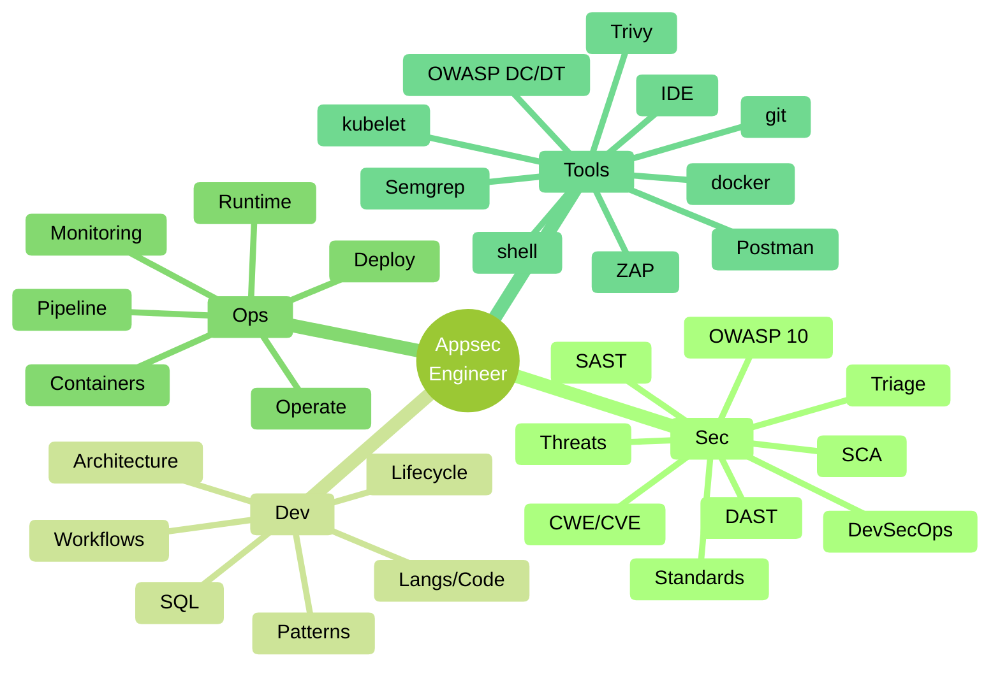

# Путь развития AppSec инженера

```mermaid
%%{init: {'theme':'forest'}}%%
mindmap
  root((Appsec<br/>Engineer))
    Sec
      OWASP 10
      CWE/CVE
      SCA
      SAST
      DAST
      DevSecOps
      Triage
      Threats
      Standards 
    Dev
      Langs/Code
      Lifecycle
      Architecture
      Patterns
      Workflows
      SQL
    Ops
      Pipeline
      Containers
      Runtime
      Deploy
      Operate
      Monitoring
    Tools
      IDE
      git
      Postman
      ZAP
      Semgrep
      Trivy
      OWASP DC/DT
      shell
      docker
      kubelet
```
